<h1 align="center">Hey 👋, I'm David</h1>

## 💬 About me
### Programming Languages

    
    
    
    
    
    

### Frameworks

    
    
    
    

### Databases

    
    
    

### CSS Frameworks

    
    

### 🗣️ Spoken Languages
- 🇫🇷 French Mother tongue
- 🇬🇧 English C1
- 🇯🇵 Japanese A2

## 📅 Hobbies
- Taking a stroll in nature
- Home workout
- Watch anime
- Read manga
- Play videogames
- Nuclear physics

## 📚 Learning
- OAuth2
- Docker
- 🇯🇵 Japanese

## 🔗 Links
- [CV on GitHub Pages](https://catdesu.github.io/)
- [LinkedIn](https://www.linkedin.com/in/aeschlimann-david)
- [GitHub](https://github.com/catdesu) ← You're here !
