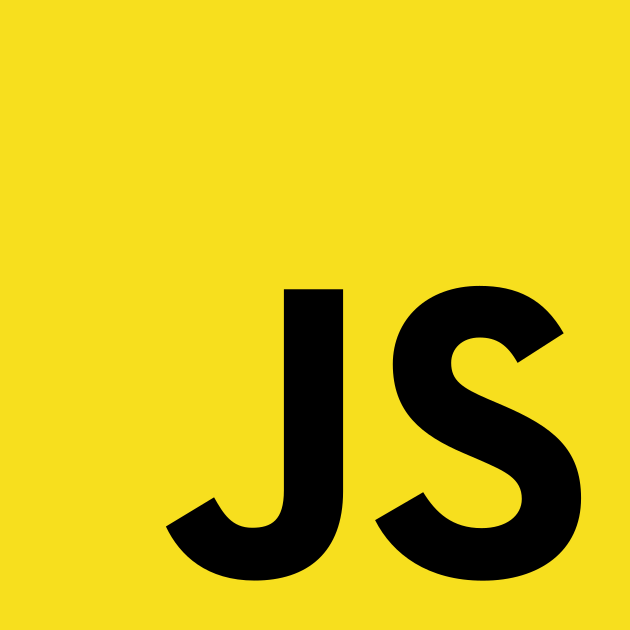
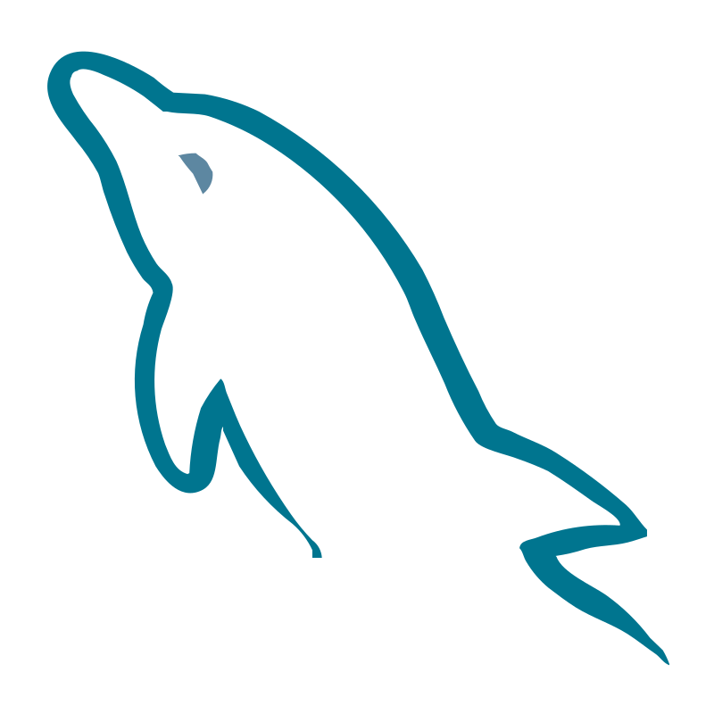
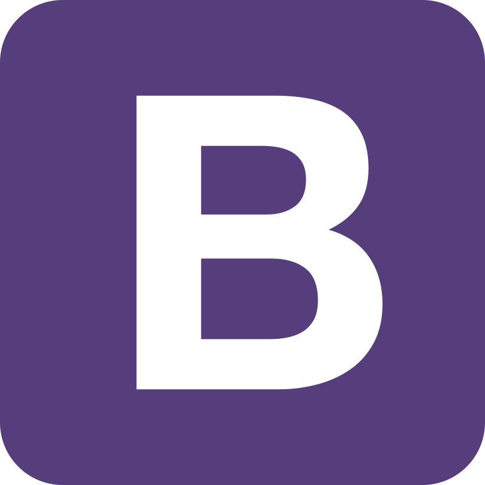
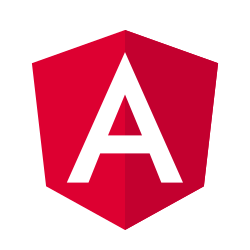

<h1>Hey 👋, I'm David</h1>

## 💬 About me

Full-stack web dev: **October CMS** & **Laravel**, design integration, client-editable sites, **Filament**, **Bootstrap/Tailwind**.

### What I work with

    
    
    
    
    
    
    
    

### Also familiar with

    
    
    

### 🗣️ Spoken Languages
- 🇫🇷 French Mother tongue
- 🇬🇧 English C1
- 🇯🇵 Japanese A2

## 📅 Hobbies
- Nuclear physics
- Home workout
- Japanese culture
- Videogames

## 🔗 Links
- [CV on GitHub Pages](https://catdesu.github.io/)
- [LinkedIn](https://www.linkedin.com/in/aeschlimann-david)
